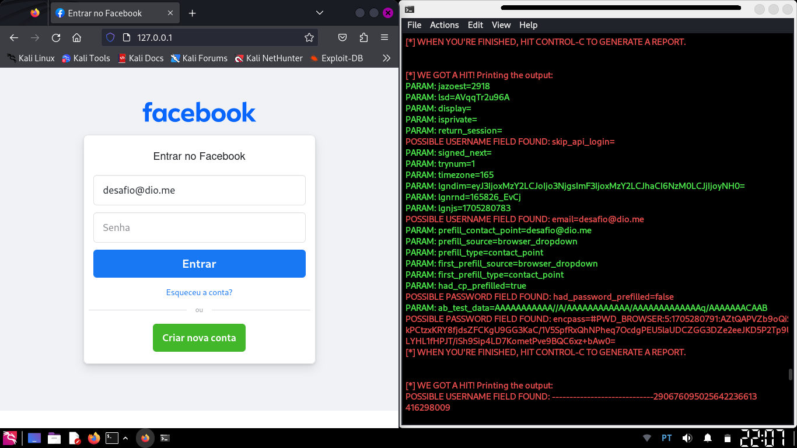
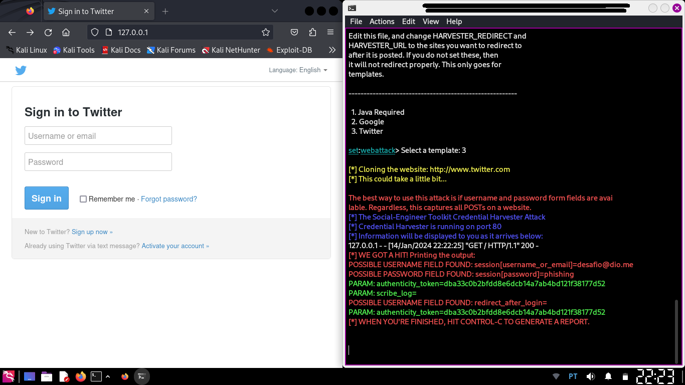

# Phishing para captura 

Desafio de segurança do curso da DIO que consta em utilizar a ferramenta para exibir uma página falsa e captura os dados do usuário, aplicando assim a técnica de phishing.
A atividade foi realizad de duas maneiras, a primeira executando um clone de um site e a segunda utilizando o template pronto da ferramenta.

## Ferramentas

- Kali Linux
- setoolkit

## Configurando o Phishing no Kali Linux para Facebook

- Acesso root: ``` sudo su ```
- Iniciando o setoolkit: ``` setoolkit ```
- Tipo de ataque: ``` Social-Engineering Attacks ```
- Vetor de ataque: ``` Web Site Attack Vectors ```
- Método de ataque: ```Credential Harvester Attack Method ```
- Método de ataque: ``` Site Cloner ```
- - Webattack: ``` local host ```
- URL para clone: http://www.facebook.com ou http://127.0.0.1

### Resutado 1




## Configurando o Phishing no Kali Linux para Web

- Acesso root: ``` sudo su ```
- Iniciando o setoolkit: ``` setoolkit ```
- Tipo de ataque: ``` Social-Engineering Attacks ```
- Vetor de ataque: ``` Web Site Attack Vectors ```
- Método de ataque: ```Credential Harvester Attack Method ```
- Método de ataque: ``` Web Templates ```
- Webattack: ``` local host ```
- Template: ``` Twitter ```
- URL para clone: http://www.twitter.com ou http://127.0.0.1

### Resutado 2


